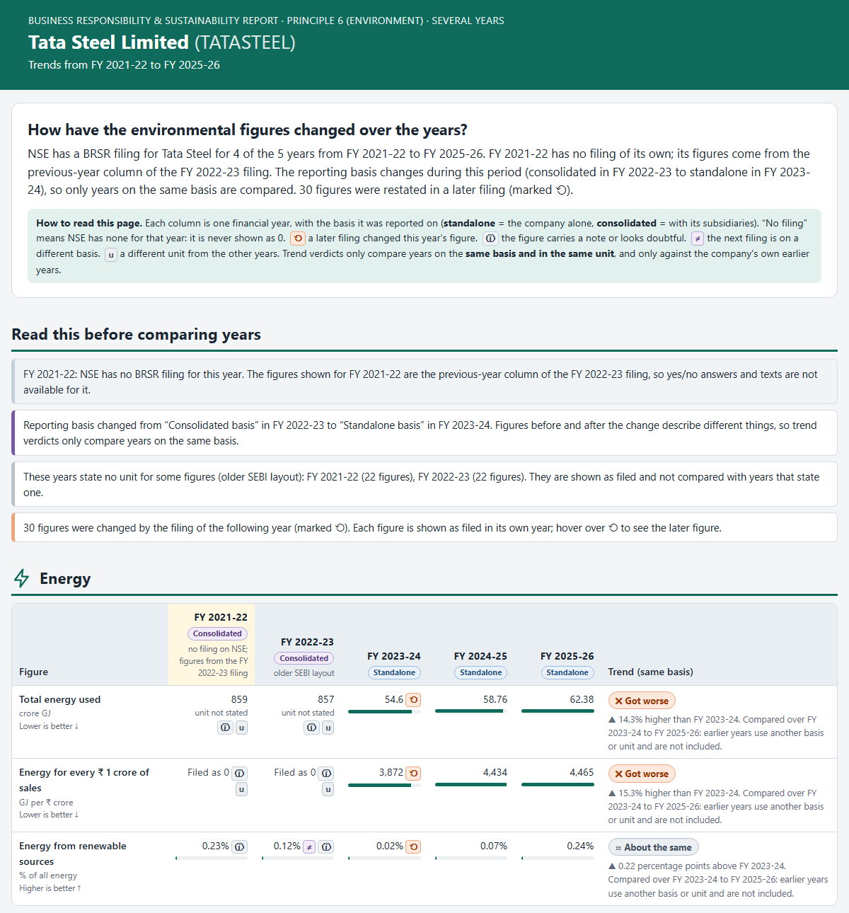
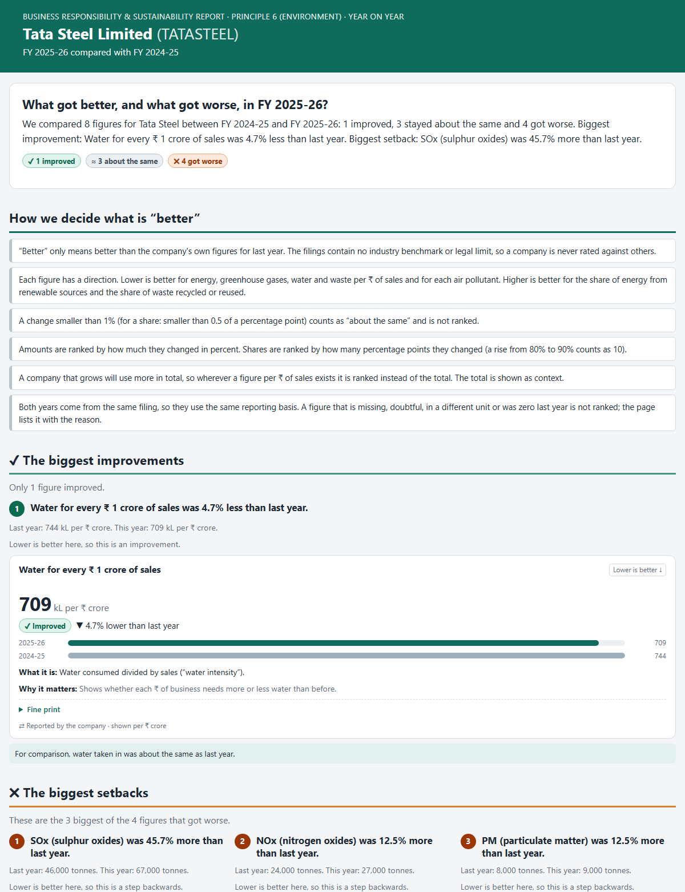

# BRSR Principle 6 Report Generator & Environmental Dashboard

Give it a listed Indian company and a financial year. It writes **one HTML page** with two views of that company's BRSR
**Principle 6 (environment)** disclosures, built from the filing on NSE:

1. **Dashboard** (opens first): the same data in plain English for a non-expert. For every figure it says *what it measures*,
   *whether it got better or worse than last year* and *why it matters*.
2. **SEBI-format report**: laid out like SEBI's May 2021 template, with the same question numbers, wording, tables and row labels.

**One command does the whole flow, `python flow.py`:** download the filing from NSE, read it, clean and check it, write the page. The three extensions
and a viewer are sub-commands of the same file (`python flow.py --help` lists them):

| Command | What it does |
|---|---|
| `flow.py` | **Core task.** The report page: Dashboard tab + SEBI-format tab |
| `flow.py trends` | **Extension 1.** One company over several years, side by side; missing years flagged |
| `flow.py summary` | **Extension 2.** The 3 biggest improvements and 3 biggest setbacks against last year |
| `flow.py compare` | **Extension 3.** Two companies, one year, compared fairly |
| `flow.py hub` | Puts every page you have made behind two simple viewer pages (pick a company; pick two to compare) |
| `flow.py download`, `extract`, `samples` | Single steps: only download; download + read + clean + print; rebuild `samples/` |


> **Sample pages** (no setup, open in a browser): [`samples/index.html`](samples/index.html), then choose a company and a year. The [list](samples/README.md) says what each page shows.
> **Architecture (one diagram):** [`architecture.md`](architecture.md). **Every command with examples:** [`commands.md`](commands.md).

## Quick start

```powershell
python -m venv .venv
.venv\Scripts\Activate.ps1                       # macOS / Linux: source .venv/bin/activate
pip install -r requirements.txt
python flow.py --company "Reliance" --fy 2023-24 --open
```

- Python 3.10 or newer (developed and tested on Python 3.14 on Windows 11; not tested on other versions or on macOS / Linux). Libraries: `requests`, `Jinja2`, `pytest` (pinned in `requirements.txt`).
- The page is written to `output/RELIANCE_2023-24.html`. The first run for a company downloads its filing from NSE (about 10 seconds, polite and cached); after that it takes under a second.
- Internet is needed only to download a filing for the first time.

## Run commands

```powershell
python flow.py --company "Tata Steel" --fy 2025-26 --open                                  # the report page
python flow.py trends  --company "Tata Steel" --from 2021-22 --to 2025-26 --open           # Extension 1 (--from / --to optional)
python flow.py summary --company "Tata Steel" --open                                       # Extension 2 (--fy optional: default = newest)
python flow.py compare --company-a "Tata Steel" --company-b "Wipro" --fy 2025-26 --open    # Extension 3
python flow.py hub --open                                                                  # every page in output/ behind a home page and a compare page
python flow.py download --company Reliance                                                 # only download every year NSE has
python flow.py extract --company Reliance --fy 2023-24 --questions E1 --trace              # clean, print as text, show the filing's element behind each value
python flow.py samples                                                                     # rebuild the pages in samples/
pytest                                                                                     # the tests (no internet needed)
```

- `--company` takes a name (`"Tata Steel"`) or the NSE symbol (`TATASTEEL`). `--fy` takes `2023-24`, `2023-2024`, `FY2023-24` or `2023/24`. `python flow.py --help` shows all options.
- Output: `output/<SYMBOL>_<FY>.html`, one self-contained file (no JavaScript, no internet needed to open it). Filings are kept in `data/raw/<SYMBOL>/<FY>/`, the cleaned data in `data/parsed/`.
- **Eleven filings are committed** (Tata Steel, Reliance, Wipro, Infosys, HDFC Bank), as the brief allows when documented ([`data/README.md`](data/README.md)), so a fresh clone can rebuild `samples/` and run every test without the internet. Any other company is downloaded on demand.

## Inputs to try

| Command | What it shows |
|---|---|
| `--company "Reliance" --fy 2023-24` | The cleanest example: almost every card has a better / worse verdict |
| `--company "Tata Steel" --fy 2025-26` | Emissions typed in the wrong scale ("64" for 64 million): shown as filed, warned, never compared |
| `--company "Wipro" --fy 2025-26` | IT services; energy filed in megajoules is shown in GJ and marked "unit changed by us" |
| `--company "Infosys" --fy 2021-22` | Older filing layout, a damaged XML file that was cleaned, energy with no unit |
| `--company "HDFC Bank" --fy 2022-23` | A bank: sparse data, many "Not reported" and "reported as 0"; the page stays honest |
| `--company "TCS" --fy 2024-25`, `--company "ONGC" --fy 2023-24` | Other sectors and filing styles (ONGC files air pollutants as concentrations, not tonnes) |
| `trends --company "Tata Steel" --from 2021-22 --to 2025-26` | A year NSE does not have (filled from the next filing and marked), a switch from consolidated to standalone, restated figures |
| `trends --company "Wipro" --from 2023-24 --to 2025-26` | The reporting basis flips every year, so only years on the same basis are compared |
| `summary --company "Tata Steel"` | A mixed year: one figure improved, three about the same, four got worse (SOx +45.7%) |
| `summary --company "Wipro"` | All 9 comparable figures improved; the page says plainly that nothing got worse |
| `summary --company "Reliance" --fy 2022-23` | **Previous year's filing missing** (none on NSE): the previous-year column of this filing is used, and the page says so |
| `compare --company-a "Tata Steel" --company-b "Wipro" --fy 2025-26` | A steel maker against an IT firm: totals differ by hundreds of times and are not ranked; per-₹ figures and shares are |
| `compare --company-a "HDFC Bank" --company-b "Reliance" --fy 2022-23` | Units missing or zero on one side, so only the two shares get a verdict |
| `--company "Xyzzy Quux" --fy 2023-24` | Error page: unknown company |
| `--company "Tata Steel" --fy 2021-22` | Error page: NSE has no filing for that year; lists the years it does have |
| `--company "Reliance" --fy 2019-20` | Error page: before BRSR reporting began (FY 2021-22) |

## What is completed

**Core task: complete.** Company + year in, one HTML page with a SEBI-format view and a plain-English dashboard out.

| Part | Status |
|---|---|
| Works for any NSE-listed company that filed a BRSR for FY 2021-22 or later (nothing hard-coded); an earlier year gets a clear message | ✅ |
| SEBI-format view: all 21 Principle 6 questions (12 Essential, 9 Leadership) in SEBI's order, current and previous year, units, "Not reported" shown explicitly | ✅ |
| Dashboard: six topics, headline sentences, metric cards (what / better or worse / why), charts, safeguards, trust panel, glossary | ✅ |
| Never invent numbers: missing, converted, calculated and doubtful values are labelled; **every figure traces back to the filing** | ✅ |
| Polite to NSE: 3 s between requests, cache everywhere, retries only for temporary problems, stops on 403 / 429 | ✅ |
| Error pages for every failure, not only console messages | ✅ |
| Sample pages in `samples/`: 5 reports, 3 trends, 3 summaries, 3 comparisons, 6 error cases, and the two viewer pages | ✅ |
| Code in nine layered packages, extraction separate from presentation, the layer rule checked by a test | ✅ |
| **Extension 1: multi-year trends.** Company + start + end year, all figures side by side, missing years flagged, basis changes and restatements marked | ✅ |
| **Extension 2: year-on-year summary.** Newest year chosen automatically, 3 best + 3 worst with a plain-English explanation, "better" defined on the page, missing previous report handled | ✅ |
| **Extension 3: company comparison.** Two companies, one year; totals shown but not ranked, verdicts only on per-₹ figures and shares, units made the same, "Not reported" never 0 | ✅ |
| Not done: the optional screen recording | – |

## How the data is extracted

```
company text ─► NSE symbol ─► filing list ─► XBRL file (cached) ─► facts ─► SEBI template rows ─► checks ─► HTML page
```

- **Source:** the BRSR filings on NSE. The website loads them through an undocumented JSON endpoint (found with the browser's DevTools): one request for the
  company's filings with a date range, after one visit to the home page for cookies. File links are taken from NSE's answer, never guessed. We use the
  **XBRL (XML)** version of each filing, which is structured and far more reliable than PDF tables.
- **Two layouts of the same SEBI form** exist (before and after April 2024). Both are mapped to the same SEBI rows (`p6_mapping.py`); the edition is detected from the file
  and shown in the page header. Which year is "current" is decided from the file's reporting-period dates, not from labels.
- **Units are normalised and shown:** energy in GJ, water in kL, waste and air pollutants in tonnes, greenhouse gases in tCO₂e. Anything converted is marked and the
  filed figure is kept. (In real filings `MtCO2e` means metric tonnes, not million tonnes, and older filings often state no energy unit, so we say so.)
- **Checks only add warnings, they never change a number:** an intensity of 0, a total that does not equal its parts, a pollutant reported as 0, an intensity with one
  digit of precision (too coarse to compare), and emissions a thousand or a million times too small for the company's energy use (this caught Tata Steel).
- **Which filing:** NSE keeps one row per company per year and a revision replaces the original, so we use the latest revision. We do not choose between standalone and
  consolidated; we use the filing NSE lists and the page header states its reporting boundary.
- **Every number traces back to the filing.** Each value remembers its XBRL element, the year, the text exactly as written and the unit as written. Follow it from a dashboard
  card (*Fine print → Where it is in the filing*), from a hover in the SEBI tab, from the SEBI tab's last section *Where every number comes from*, or in the terminal with
  `flow.py extract --trace`; the page links to NSE's file. A test checks every value of every filing on disk against the raw XML, independently of our own reader.
- **Verification:** key numbers for Tata Steel FY 2025-26 were compared by hand with the company's own PDF report and are pinned in tests; other companies are covered by the checks above.

## Extension 1: multi-year trends

`python flow.py trends --company "<name>" [--from 2021-22] [--to 2025-26]` makes one page with a column per financial year: the five topics first (each row with a mini bar
per year and a trend verdict), then every figure of SEBI's Principle 6 tables, then the figures that later filings changed.



- **Missing years are flagged, never skipped or zero-filled.** A year NSE has no filing for shows "No filing". If the *next* year's filing exists, its previous-year column holds the company's own figures for the missing year; they are shown, marked "figures from the FY ... filing".
- **Every year says on which basis it was reported.** Verdicts only compare years on the same basis and in the same unit, so a change of basis can never look like an improvement.
- **Restatements are marked** (⟲) when the next filing gives a different figure for the same year. Each figure stays **as filed in its own year**; the later figure is in the tooltip.
- **One bad year does not stop the page:** a damaged or missing filing becomes a flagged column with its reason. Only problems with the whole request (unknown company, no filings, NSE unreachable, years the wrong way round) give an error page.

## Extension 2: year-on-year summary

`python flow.py summary --company "<name>" [--fy 2025-26]` writes `output/<SYMBOL>_summary_<FY>.html`. Without `--fy` it takes the newest filing NSE has. The page opens with one sentence and a scoreboard,
then **the 3 biggest improvements and the 3 biggest setbacks**, each with a plain headline, last year's and this year's figure and the same card as on the dashboard.



How "better" is defined (also printed on the page):
- **Better means better than the company's own last year.** The filings hold no benchmark or legal limit, so nothing is rated against other companies.
- **Each figure has a direction:** lower is better for energy, greenhouse gases, water and waste per ₹ of sales and for each air pollutant; higher is better for the share of renewable energy and of waste recycled.
- **A change under 1% (a share: under half a percentage point) is "about the same".** Amounts are ranked by percent change, shares by percentage points. A figure per ₹ of sales is ranked instead of its total, which grows when a company grows.
- **Not ranked, with the reason listed:** a figure that is missing, doubtful, in a different unit or zero last year.
- **Missing previous-year report is not an error.** Both years come from the same newest filing (which carries last year's column). If last year's own filing exists it is only used to mark restated figures; if it is missing or damaged the page says so. If the newest filing cannot be read there is nothing to summarise, so an error page is written.

## Extension 3: company comparison

`python flow.py compare --company-a "<name>" --company-b "<name>" --fy 2025-26` writes `output/<A>_vs_<B>_<FY>.html`: one sentence and a scoreboard, the two filings, the rules, then one table per topic.

- **Totals are shown but never ranked:** a bigger company uses more (Tata Steel's total energy is 888 times Wipro's). They carry the label "Depends on size".
- **Verdicts only on the fair measures:** the figure per ₹ 1 crore of sales (lower is better) and the shares of renewable energy and recycled waste (higher is better, in percentage points).
- **Same unit, same scale** in both columns, and a real figure is never shown as "0 crore". **Missing is not zero:** "Not reported" says who did not report it. Doubtful, too-coarse or differently-united figures are shown as filed and not compared.
- **Different scope is warned about** (one company standalone, the other consolidated). No benchmark is used, and the page says why.

## All pages in one place (`flow.py hub`)

`python flow.py hub --open` puts everything in `output/` behind two simple pages: **`index.html`** (choose a company and a year; its report opens with the Dashboard and SEBI tabs, plus *Report / Year-on-year / Multi-year trend* buttons)
and **`compare_companies.html`** (choose a year and two companies). Before building them it makes, **offline from the filings already on disk**, any year-on-year, trend or comparison page that would otherwise be greyed out, and it never
overwrites one you made yourself (`--only-existing` makes none). Each is one self-contained file, so keep both in the same folder; `--link` makes tiny pages that open the files next to them (used for `samples/`). These are the only pages with a script,
and the frame that shows a report is sandboxed.

## Error handling

Every failure still produces a page, `output/error_<company>_<year>.html`, so the reason appears where the report would have been. It says what went wrong, what you typed, what to try, and gives ready-to-run commands where possible.

| Situation | What the user sees |
|---|---|
| Company not found, or several match | A "not found" page with spelling advice, or the matches, each with a command using its NSE symbol |
| Year not understood, or before FY 2021-22 | What formats work, or that BRSR reporting began in FY 2021-22 |
| NSE has no filing for that year / the company filed no BRSR | The years NSE does have, each with a command / that only the top 1,000 listed companies must file |
| NSE unreachable or blocking | Advice to retry; companies already downloaded keep working |
| Damaged or wrong kind of filing file | The file name and the problem: "we show nothing rather than guess". On a trend page only that year's column is flagged |
| Trend years the wrong way round, or too many | "That range of years cannot be used", with an example |
| Summary: last year's own filing missing or damaged | Not an error: the previous-year column is used and the page says why |
| Comparison: the same company twice, or a company/year with a problem | "A comparison needs two different companies", or the specific error page |
| Any unexpected bug | A page saying so with the technical reason; `--debug` shows the traceback |

## Known limitations

- **"Better / worse" is only against the company's own previous year** (within ±1% is "about the same"). There is no benchmark or legal limit in the filings, so there is no rating or score. The one-year dashboard and summary use the previous-year column of the same filing, which can differ from last year's own filing if the company restated (the summary checks and says so).
- **Comparison covers two companies and one year**, and only the headline figures (up to 14 rows), not every SEBI row. It is not a ranking of "greener" companies. The compare page only offers pairs whose pages exist (made by `flow.py hub` or `flow.py compare`); it downloads nothing.
- **The summary ranks only the headline figures** (energy, greenhouse gases, water, waste, renewable and recycled shares, four air pollutants). **Trend pages** show a restated figure as originally filed, never infer a missing unit, and a year borrowed from the next filing has no yes/no answers or texts.
- **Waste recovery and disposal are totals only:** SEBI asks for them per waste category, the structured filing gives one total.
- **Some SEBI items have no XBRL field** and are always "Not reported": the non-compliance table, the level of treatment of discharged water, "Others – please specify" air pollutants, and the EIA web link.
- **Older filings** (before April 2024) have no energy unit, free-text emission units and often no intensity units. They are shown as filed with a note. PPP-adjusted and per-tonne intensities appear only in the SEBI tab, because their unit labels are unreliable.
- **Mistakes we cannot detect:** an error of a few percent, or a wrong figure that still looks plausible, passes through. Only large scale slips, zero intensities and totals that disagree with their parts are caught.
- **NSE's endpoints are undocumented** and may change; a company you have never downloaded needs internet and can be refused (HTTP 403 / 429).
- **Tested only in Edge (Chromium) on Windows.** The report, trend, summary and error pages use no JavaScript, so other browsers should work. The two viewer pages use a small script, and they do not refresh themselves: run `python flow.py hub` again after making new pages.

## Design note

**Who it is for.** A non-expert: an investor, journalist or student who has never opened a BRSR. They want four answers, and the page is ordered to give them: *How big is the footprint? Is it better or worse than last year? Is it under control? Can I trust these numbers?*


- **A summary first, detail after.** One plain sentence and a scoreboard, then six topics in a story order (energy used, gases released, water, air, waste, the rules in place), each opening with a headline sentence built from the numbers.
- **Every number explains itself.** A plain title, which direction is better, *what it is* and *why it matters* are always visible; the exact figure and how we calculated it sit in collapsible fine print. Jargon is explained in a glossary.
- **Totals mislead, so intensity sits beside them.** A growing company uses more in total, so each topic also shows the figure per ₹ 1 crore of sales. Big numbers are written in lakh and crore, matching the SEBI tab.
- **"Better" means better than the company's own last year, nothing more.** Inventing a benchmark would break "never invent numbers".
- **Doubt is visible, never hidden.** A figure that looks wrong is shown exactly as filed, with a calm grey note (ⓘ, never a yellow box or warning triangle) and no verdict, and is left out of the summary sentences. A missing figure says "Not reported" (never 0).
- **Never colour alone.** Verdicts are words plus symbols (✔ ✖ ≈ ?) plus arrows, and the layout works on a phone.
- **Built to be trusted.** Python decides every verdict and sentence and the HTML templates only print, so every rule has a test, and the SEBI tab and dashboard start from the same cleaned data.

The design was prototyped first with real numbers: [`design/dashboard_mockup.html`](design/dashboard_mockup.html).

## Tests and project structure

```powershell
pytest          # about 720 tests, under a minute, no internet
```

They cover unit conversion, the XBRL reader, every SEBI row, the verdict and sentence rules, HTML well-formedness, escaping of filing text, the error pages, real-filing spot checks, the trace of every value to the raw XML, and "the committed sample pages are up to date". The test folders mirror the code folders (`pytest tests/views` runs one layer).

```
flow.py              THE one command (a 10-line launcher) and its sub-commands
brsr_p6/             the code, one package per step of the journey from NSE to the page:
  core/                data model and shared helpers: models, errors, fiscal_year, units, formatting, friendly, sebi_template, paths
  download/            1. get the filing: nse_client, company_lookup, filings, downloader
  parsing/             2. read the XBRL file: xbrl_reader, p6_mapping
  extraction/          3. clean it into one Principle6Report: extractor, checks, values, report_io
  analysis/            4. compare years (pure logic): comparison, warning_kinds, trend_model
  views/               5. decide what each page says: dashboard, SEBI, trace, trend, summary, compare, hub and error views
  rendering/           6. fill the HTML templates (Jinja2): render, templates/
  workflows/           whole jobs end to end: pipeline (the flow), trend/summary loaders, compare, missing_pages, hub, samples
  cli/                 the command line: flow_cli (the flow + the dispatcher) and one module per sub-command
tests/               automatic tests, in folders that mirror brsr_p6/
samples/             sample report, trend, summary, comparison and error pages (+ README)
data/                filings downloaded from NSE (11 committed, see data/README.md) and the cleaned JSON
design/  docs/       the dashboard prototype; the screenshots used in this README
architecture.md  plan.md  context.md  commands.md   the architecture, the plan, the decision log, the command cheat-sheet
```

**The layer rule.** A package may import only from itself and from the packages listed before it (`core` first): `core` knows nothing about `views`, and `views` knows nothing about how a page is laid out or saved. Only `download` talks to NSE, only `rendering` writes the pages, and `workflows` put the steps in order. `tests/test_architecture.py` fails with the exact file and line if the rule is broken. See [`architecture.md`](architecture.md).

## AI tools used

| Tool | Used for |
|---|---|
| Claude Code (Claude Sonnet 5.5) | Reading the brief and planning in phases. Exploring NSE's endpoints and the XBRL files with throwaway probe scripts (kept outside the repository). Writing the downloader, XBRL reader, cleaner, SEBI page, dashboard, error pages, trends, year-on-year summary, comparison, viewer pages, samples and tests, and reorganising the code into layered packages. Reading real output to find bugs (double-counted energy, a mis-scaled emissions figure, false "got worse" claims) and fixing them. Writing this README, `architecture.md`, `commands.md` and `context.md`. |

All code was run and checked against real filings and by the tests; the decisions behind it are recorded in `context.md`.
