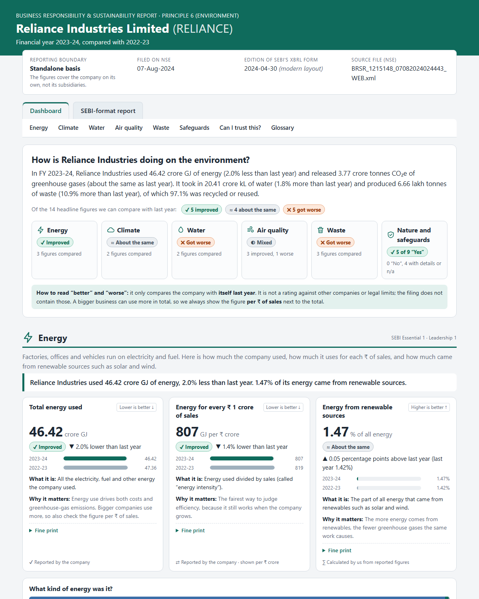
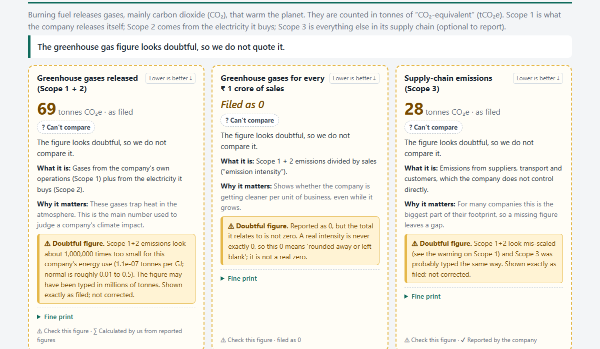

# BRSR Principle 6 Report Generator & Environmental Dashboard

Give it a listed Indian company and a financial year. It produces **one HTML page** with two views of that company's BRSR
**Principle 6 (environment)** disclosures, built from the company's filing on NSE:

1. **Dashboard** (opens first): the same data in plain English for a non-expert. For every figure it says *what it measures*,
   *whether it got better or worse than last year* and *why it matters*.
2. **SEBI-format report**: laid out like SEBI's May 2021 template, same question numbers, wording, tables and row labels.

**There is one command, `python flow.py`.** Given a company and a year it runs the whole flow: download the filing from NSE, read it, clean and check it,
write the page. Everything else is a sub-command of the same file (`python flow.py --help` lists them):

- `flow.py trends` shows one company over **several years side by side**: missing years are flagged (never skipped or filled with zero),
  changes of reporting basis and restated figures are marked, and trend verdicts only compare years that can really be compared.
- `flow.py summary` answers "what got **better** and what got **worse** since last year?": the **3 biggest improvements and 3 biggest
  setbacks** of the newest filing, each explained in plain English, with the definition of "better" stated on the page.
- `flow.py compare` puts **two companies side by side for the same year** and says which does better on the measures that can be compared
  fairly (a bigger company uses more, so totals are shown but never ranked).
- `flow.py hub` puts **every page you have made behind two simple pages**: pick a company and see its report, or press *Compare two companies*
  and pick two (see "All pages in one place").
- `flow.py download`, `flow.py extract` and `flow.py samples` run a single step (only the download; download + read + clean + print; rebuild `samples/`).



> **Demo cheat-sheet:** [`commands.md`](commands.md) has every command with copy-paste examples.
> **Sample pages** (open in a browser, no setup): open [`samples/index.html`](samples/index.html), choose a company and a year, or see the [list](samples/README.md).

## Quick start

```powershell
python -m venv .venv
.venv\Scripts\Activate.ps1
pip install -r requirements.txt
python flow.py --company "Reliance" --fy 2023-24 --open
python flow.py trends --company "Tata Steel" --from 2021-22 --to 2025-26 --open     # several years side by side
python flow.py summary --company "Tata Steel" --open                                # what got better / worse since last year
python flow.py compare --company-a "Tata Steel" --company-b "Wipro" --fy 2025-26 --open   # two companies, one year
```

The page is written to `output/RELIANCE_2023-24.html`. The first run for a company downloads its filing from NSE (about 10 seconds,
polite and cached); after that it takes under a second.

## Requirements and setup

- Python 3.10 or newer (developed and tested on Python 3.14 on Windows 11; not tested on other versions or on macOS / Linux).
- Internet access only to download a filing the first time. Libraries: `requests`, `Jinja2`, `pytest` (pinned in `requirements.txt`).

| | Windows (PowerShell) | macOS / Linux |
|---|---|---|
| Create the environment | `python -m venv .venv` | `python -m venv .venv` |
| Activate it | `.venv\Scripts\Activate.ps1` | `source .venv/bin/activate` |
| Install | `pip install -r requirements.txt` | `pip install -r requirements.txt` |

## Run commands

```powershell
python flow.py --company "Tata Steel" --fy 2025-26 --open     # the report page (downloads, cleans, writes the page)
python flow.py --help                                         # all options (--output-dir, --debug as well)
python flow.py trends --company "Tata Steel" --from 2021-22 --to 2025-26 --open   # several years side by side (--from / --to are optional)
python flow.py summary --company "Tata Steel" --open                              # 3 best and 3 worst changes (--fy picks a year; default = newest)
python flow.py compare --company-a "Tata Steel" --company-b "Wipro" --fy 2025-26 --open   # two companies side by side for one year
python flow.py hub --open                                                         # every page in output/ behind a home page (choose a company) and a compare page (choose two)

python flow.py download --company Reliance                 # only download: every year NSE has for the company
python flow.py extract --company Reliance --fy 2023-24      # only clean: print the SEBI rows as text, save the JSON
python flow.py extract --company Reliance --fy 2023-24 --questions E1 --trace   # ... with the filing's element behind every value
python flow.py samples                                        # rebuild the pages in samples/
pytest                                                        # the automatic tests (no internet needed)
```

- `--company` takes a name (`"Tata Steel"`) or the NSE symbol (`TATASTEEL`). `--fy` takes `2023-24`, `2023-2024`, `FY2023-24` or `2023/24`.
- Output: `output/<SYMBOL>_<FY>.html`, one self-contained file (no JavaScript, no internet needed to open it).
- Downloaded filings are kept in `data/raw/<SYMBOL>/<FY>/`; the cleaned data in `data/parsed/<SYMBOL>/<FY>.json`.
- **Eleven filings are committed** (Tata Steel, Reliance, Wipro, Infosys, HDFC Bank) so that a fresh clone can rebuild `samples/` and run every
  test without the internet, as the brief allows. They are listed and explained in [`data/README.md`](data/README.md). Every other company is
  downloaded on demand.

## Inputs to try

| Command | What it shows |
|---|---|
| `--company "Reliance" --fy 2023-24` | The cleanest example: almost every card has a better / worse verdict. |
| `--company "Tata Steel" --fy 2025-26` | A figure typed in the wrong scale (emissions "64" instead of 64 million): shown as filed, warned, never compared. |
| `--company "Wipro" --fy 2025-26` | IT services. Energy filed in megajoules is shown in GJ and marked "unit changed by us". |
| `--company "Infosys" --fy 2021-22` | An older filing layout, a damaged XML file that was cleaned, monthly air figures, energy with no unit. |
| `--company "HDFC Bank" --fy 2022-23` | A bank: sparse data, many "Not reported" and "reported as 0", and the page stays honest. |
| `--company "TCS" --fy 2024-25`<br>`--company "ONGC" --fy 2023-24` | Other sectors and filing styles (for example ONGC files its air pollutants as concentrations, not tonnes). |
| `flow.py trends --company "Tata Steel" --from 2021-22 --to 2025-26` | **Trends:** a year NSE does not have (FY 2021-22, filled from the next filing's previous-year column and marked), a change from consolidated to standalone, restated figures, mis-scaled emissions. |
| `flow.py trends --company "Wipro" --from 2023-24 --to 2025-26` | **Trends:** the reporting basis flips from year to year, so only the two consolidated years are compared. |
| `flow.py trends --company "Reliance"` | **Trends:** one basis throughout, so every year is compared; FY 2022-23 uses the older layout with no energy unit. |
| `flow.py summary --company "Tata Steel"` | **Summary:** a mixed year. One figure improved (water per ₹ crore), three stayed about the same, four got worse (SOx +45.7%, NOx, PM). |
| `flow.py summary --company "Wipro"` | **Summary:** all 9 comparable figures improved, so the page shows the three biggest and says plainly that nothing got worse. |
| `flow.py summary --company "Reliance" --fy 2022-23` | **Summary:** NSE has no filing for FY 2021-22, so there is no report of last year's own; the page uses the previous-year column of this filing and says so. |
| `flow.py compare --company-a "Tata Steel" --company-b "Wipro" --fy 2025-26` | **Comparison:** a steel maker against an IT firm. Totals differ by factors of hundreds and are not ranked; the per-₹ figures and shares are. The page warns that one reports standalone and the other consolidated. |
| `flow.py compare --company-a "Reliance" --company-b "Tata Steel" --fy 2023-24` | **Comparison:** two large companies on the same basis, so most per-₹ rows get a verdict. |
| `flow.py compare --company-a "HDFC Bank" --company-b "Reliance" --fy 2022-23` | **Comparison:** a bank against a conglomerate in the older layout: the bank's per-₹ figures have no stated unit and Reliance filed its own as 0, so only the two shares get a verdict. |
| `--company "Xyzzy Quux" --fy 2023-24` | An error page: unknown company. |
| `--company "Tata Steel" --fy 2021-22` | An error page: NSE has no filing for that year, and it lists the years it does have. |
| `--company "Reliance" --fy 2019-20` | An error page: before BRSR reporting began. |

## What is completed

**Core task: complete.** Input company + year, output one HTML page with a SEBI-format view and a plain-English dashboard.

| Part | Status |
|---|---|
| Works for any NSE-listed company that filed a BRSR for FY 2021-22 or later (nothing hard-coded) | ✅ |
| SEBI-format view: all 21 Principle 6 questions (12 Essential, 9 Leadership) in SEBI's order, current and previous year, units, "Not reported" shown explicitly | ✅ |
| Dashboard: six topics, headline sentences, metric cards (what / better or worse / why), charts, safeguards, trust panel, glossary | ✅ |
| Never invent numbers: missing, converted, calculated and doubtful values are all labelled | ✅ |
| **Every figure traces back to the filing:** each number names the XBRL element and the text it was read from, with a link to NSE's file (see "Every number traces back to the filing") | ✅ |
| Polite to NSE: 3 s between requests, cache everywhere, retries only for temporary problems, stops on 403 / 429 | ✅ |
| Error pages for every failure, not only console messages | ✅ |
| Sample pages in `samples/`: 5 company reports, 3 trend pages, 3 summaries, 3 company comparisons and 6 error cases | ✅ |
| One place for all outputs: `flow.py hub` puts every generated page behind a home page (choose a company and a year) and a compare page (choose two companies), `output/index.html` and `output/compare_companies.html` (and the same in `samples/`) | ✅ |
| Code organised in nine layered packages (download, parsing, extraction, analysis, views, rendering, ...), the layer rule checked by a test | ✅ |
| **Extension 1:** multi-year trends (`flow.py trends`): company + start year + end year, all figures side by side, missing years flagged, basis changes and restatements marked, error pages | ✅ |
| **Extension 2:** year-on-year summary (`flow.py summary`): the newest year chosen automatically, 3 best + 3 worst against the previous year with a plain-English explanation each, "better" defined on the page, missing previous-year report handled, error pages | ✅ |
| **Extension 3:** company comparison (`flow.py compare`): two companies, one financial year, side by side; totals shown but not ranked, verdicts only on per-₹ figures and shares, units made the same, "Not reported" never 0, standalone vs consolidated warned, error pages. Also offered on its own page of the viewer (`compare_companies.html`, opened by the *Compare two companies* button): year, company A, company B | ✅ |

## How the data is extracted

```
company text ─► NSE symbol ─► filing list ─► XBRL file (cached) ─► facts ─► SEBI template rows ─► checks ─► HTML page
```

- **Source:** the BRSR filings published on NSE. NSE's website loads them through an undocumented JSON endpoint (found with the browser's
  DevTools): one request for the company's filings with a date range, after one visit to the home page for cookies. File links are
  always taken from NSE's answer, never guessed. Each filing has a PDF and an **XBRL (XML)** version; we use the XML, which is structured
  and far more reliable than PDF tables.
- **Two layouts of the same SEBI form** exist (before and after April 2024). Both are mapped to the same SEBI rows (`p6_mapping.py`); the
  edition is detected from the file itself and shown in the page header. Which year is "current" is decided from the file's reporting
  period dates, not from labels.
- **Units are normalised and shown:** energy in GJ, water in kL, waste and air pollutants in tonnes, greenhouse gases in tCO₂e. Anything
  converted is marked and the filed figure is kept (in the JSON and in the dashboard's "Fine print"). In real filings `MtCO2e` means
  metric tonnes (not million tonnes), per-month air figures stay per month, and older filings often state no energy unit at all, so we say so.
- **Checks only add warnings, they never change a number:** an intensity of 0, a total that does not equal its parts, a pollutant reported
  as 0, an intensity written with a single digit of precision (`0.0000000004`: too coarse to say whether it really changed, so it is shown as filed but not compared), and emissions that look a thousand or a million times too small for the company's energy use (this caught Tata Steel).
- **Revised filings:** NSE keeps one row per company per year and a revision replaces the original, so we always use the latest revision.
- **Standalone vs consolidated:** we do not choose. We use the filing NSE lists for that year, and the page header states its reporting
  boundary. A company can switch basis between years (Wipro does), so figures should not be compared across such years.
- **Verification:** key numbers for Tata Steel FY 2025-26 were compared by hand with the company's own PDF report and are pinned in
  tests (`tests/extraction/test_real_filings.py`); other companies are covered by the consistency checks above.

## Every number traces back to the filing

The brief says *"every figure shown must trace back to a filing"*. Each value the tool keeps remembers where it came from (`Cell.origin`): the
**XBRL element** of the filing, the **year** it covers, the **text exactly as written** and the **unit as written**. A reader can follow the chain one
link at a time:

1. **Dashboard card → Fine print → "Where it is in the filing":** for each year, `TotalEnergyConsumedFromRenewableAndNonRenewableSources = 623812739.43 Gigajoule`.
   A figure we calculated (for example the renewable share) lists every element it was built from. The line above it names the SEBI question.
2. **SEBI tab → hover a number:** the same element line.
3. **SEBI tab → last section, "Where every number comes from":** every row of every question with the value shown, how we got it (*Reported by the company*,
   *Calculated by us*, *Unit changed by us*), the element(s) and the text as filed, for both years. A row the filing does not have says which elements were
   looked for, or that the structured filing has no field for it: nothing is ever filled in.
4. **The filing itself:** the page header and that section link to the XBRL file on NSE (and to its PDF). Search the file for the element name and the value is there.
5. **In the terminal:** `python flow.py extract --company "Tata Steel" --fy 2025-26 --questions E6 --trace` prints the same lines under each row.
   (On this page you can see that Tata Steel's Scope 1 is filed as `TotalScope1Emissions = 64 MtCO2e`: the value that is flagged as doubtful.) The saved JSON in `data/parsed/` carries the same `origin`.

**How we know the trace is true.** A test (`tests/extraction/test_origin.py`) opens every real filing on disk (21 on the author's machine, 5 companies, both editions; the 11 committed in the repository give 2,178 values)
and, for every value shown (4,605 of them on the author's machine, with 4,839 element references), checks with a plain regular expression on the raw XML, independently of our own reader,
that the element exists with exactly that text, and that the year is the filing's current or previous year. A value without a trace fails the test.

Limits: a long text answer is shortened to 90 characters in the trace (the full text is in the JSON and in the filing); where a filing gives a figure as several
row-labelled facts, the trace names the element and says how many rows were added; trend pages show each column's source filing, not an element per cell.

## Multi-year trends (Extension 1)

`python flow.py trends --company "<name>" [--from 2021-22] [--to 2025-26]` makes one page with a column per financial year. It first lists the five
topics (the same figures as the dashboard, each row with a mini bar per year and a trend verdict), then **every figure of SEBI's Principle 6
tables** year by year, then the figures that later filings changed. The rules, all visible on the page:

- **Missing years are flagged, never skipped or zero-filled.** A year NSE has no filing for shows "No filing". If the *next* year's filing exists,
  its previous-year column holds the company's own figures for the missing year, so those are shown, clearly marked "figures from the FY ... filing".
- **Every year says on which basis it was reported** (standalone or consolidated). Trend verdicts walk back from the latest year and stop when the
  basis or the unit changes, so a change of basis can never look like an improvement. Wipro's basis flips every year; Tata Steel changed once.
- **Restatements.** Each filing also contains the previous year's figures. If the next filing gives a different figure for the same year (more than
  0.5% apart, which is rounding), the figure is marked ⟲ and the later figure is shown in the tooltip and in a table. Each figure is kept **as filed in
  its own year**. Differences across a change of basis (≠) or with an unstated unit are *not* called restatements, because they are not comparable.
- **Units.** Older filings state no unit for some figures; they are shown as filed, marked, and not compared with years that state one.
- **One bad year does not stop the page.** A damaged or missing filing becomes a flagged column with its specific reason; the other years still show.
  Only problems with the whole request (unknown company, no filings, NSE unreachable, years the wrong way round) give an error page.

## Year-on-year summary (Extension 2)

`python flow.py summary --company "<name>" [--fy 2025-26]` writes `output/<SYMBOL>_summary_<FY>.html`. Without `--fy` it takes the **newest filing NSE has**
and downloads only that year and the one before it. The page opens with one sentence and a scoreboard, then **the 3 biggest improvements and the 3
biggest setbacks**, each with a headline ("Water for every ₹ 1 crore of sales was 4.7% less than last year"), last year's and this year's figure, which
way is better, and the same card as on the dashboard. Below come the figures that stayed about the same, a table of **every figure compared**, and a list
of the figures that were **not ranked, with the reason for each**. The page states how "better" is decided; the rules are:

- **Better means better than the company's own last year.** The filings contain no benchmark or legal limit, so nothing is rated against other companies.
- **Each figure has a direction:** lower is better for energy, greenhouse gases, water and waste per ₹ of sales and for each air pollutant; higher is
  better for the share of energy from renewables and the share of waste recycled or reused.
- **A change under 1% (for a share: under half a percentage point) is "about the same"** and is not ranked.
- **Amounts are ranked by percent change, shares by percentage points.** A renewable share that rises from 0.07% to 0.24% is "+269%" in percent but only
  0.18 of a point, and would otherwise beat a real improvement.
- **A figure per ₹ of sales is ranked instead of its total**, because a total grows when a company grows. The total is not hidden: it appears as
  context ("For comparison, total energy used was 6.2% more than last year") or in the "not ranked" list.
- **Not ranked, and said so:** a figure that is missing, doubtful, in a different unit, zero last year (a percentage cannot be worked out) or zero in both years.

**Where last year's figures come from.** Every filing carries its own year and the year before it, so both years come from the **same filing** and are on the
same reporting basis. If NSE also has last year's *own* filing and it can be read, it is checked only to mark figures the company has since **restated**
(the comparison uses the newer figure and the page says so). If last year's own filing is missing (Reliance FY 2021-22 does not exist on NSE) or damaged, that is
**not an error**: the page uses the previous-year column and says why. If the *newest* filing cannot be read there is nothing to summarise, so an error page is written.

## Company comparison (Extension 3)

`python flow.py compare --company-a "<name>" --company-b "<name>" --fy 2025-26` writes `output/<SYMBOL A>_vs_<SYMBOL B>_<FY>.html`: two companies, **one financial
year**, side by side. It downloads whichever filing is missing (politely and cached, like every command). The page opens with one sentence and a scoreboard
("Wipro is better on 4, Tata Steel on 1, 1 could not be compared"), then the two filings (boundary, filing date, a link to each file on NSE), then the rules, then
one table per topic (energy, gases, water, air, waste). The rules are printed on the page too:

- **Totals are shown but never ranked.** A bigger company uses more energy and water: Tata Steel's total energy in FY 2025-26 is 888 times Wipro's, which says nothing about effort.
  Totals carry the label "Depends on size" and only that plain ratio.
- **Verdicts only on the fair measures:** the figure per ₹ 1 crore of sales (lower is better) and the shares of renewable energy and of recycled waste
  (higher is better, compared in percentage points). Within 1% (a share: half a point) counts as "about the same".
- **Same unit, same scale.** Both numbers of a row are in one unit; they share lakh / crore only when the smaller one is still readable in it, so a real
  figure is never shown as "0 crore". A figure whose unit one company did not state is shown as filed and not compared.
- **Missing is not zero.** A figure a company did not report says "Not reported" and the row says who did not report it.
- **Doubtful or too coarse is not compared.** A mis-scaled figure, or an intensity written with one digit of precision, is shown as filed with its note.
- **Different scope is warned about.** If one company reports standalone and the other consolidated, a warning sits above the tables ("totals are not like-for-like").
- **No benchmark.** The filings contain none, and companies in different industries use energy and water very differently; the page says so.

Asking for the same company twice, an unknown company or a year NSE has no filing for gives an error page like every other command, with a suggested
`flow.py compare` command.

## All pages in one place (`flow.py hub`)

Every command writes its own page, so after a few runs `output/` holds many files. `python flow.py hub --open` puts them behind **two simple pages**: one for a
single company, and one for comparing two.

**`output/index.html`: pick a company, see its report.**
- A slim bar at the top, then one row of choices: **Company**, **Financial year** and **Show**. The report appears straight away below it, with its two tabs:
  **Dashboard** (plain English) and **SEBI-format report**.
- **Show** has three buttons: *Report*, *Year-on-year* (what got better and worse) and *Multi-year trend*. A button is greyed out when that page has not
  been made yet, and its tooltip says which command makes it.
- The big **Compare two companies** button (top right) opens the second page. Error pages (if the folder has any) have a small dropdown of their own.
- *Open in a new tab* shows the chosen page on its own. `index.html#WIPRO_2025-26` opens that page directly.
- `flow.py hub` first makes the pages that would otherwise be greyed out, **from the filings already on disk (no internet)**: a *Year-on-year* summary for every
  report page, and a *Multi-year trend* for every company with at least two years in a row saved. It never overwrites a summary or trend you made with
  `flow.py summary` / `flow.py trends`, and a summary whose previous-year filing is not saved says so on the page. `--only-existing` makes none of these.

**`output/compare_companies.html`: pick two companies, see the comparison.**
- Choose the **financial year**, then **Company A** and **Company B** (only companies that have a report for that year are offered, and B can never be A).
  The comparison appears below; it keeps the order you chose. A pair is already shown when the page opens. *← All reports* goes back.
- `flow.py hub` first writes a comparison for **every pair of companies that have a report page for the same year**, from the filings already on disk (no
  internet; `--only-existing` skips this). For a pair that has no page yet, run `flow.py compare`. With no comparison at all, this page is not made and the
  button is not shown.

**Both** are one self-contained file by default (every page is embedded); keep the two files in the same folder, because the button and *← All reports*
are links between them. `python flow.py hub --link` makes tiny pages that only open the files next to them; `python flow.py samples` builds
[`samples/index.html`](samples/index.html) and [`samples/compare_companies.html`](samples/compare_companies.html) this way, so the repository does not store
each sample page twice. Run `flow.py hub` again after making new pages; it reads whatever is in the folder (`--dir samples` for another folder).

These two are the only pages with a script (a dropdown cannot work without one); the report pages inside them still have none, and the frame that shows
them is sandboxed so a page could not run code even if it tried. Without JavaScript they show a plain list of links to the files.

## Error handling

Every failure still produces a page, `output/error_<company>_<year>.html`, so the reason appears where the report would have been.
It names what went wrong, what you typed, what to try, and gives ready-to-run commands where possible. Error pages never overwrite a report page.

| Situation | What the user sees |
|---|---|
| Company not found on NSE | "We could not find that company on NSE", with spelling and symbol advice |
| Several companies match | The matches, each with a command using its NSE symbol |
| Year not understood / before FY 2021-22 | What formats work / that BRSR reporting began in FY 2021-22 |
| NSE has no filing for that year | The years NSE does have, each with a command |
| Company filed no BRSR at all | That only the top 1,000 listed companies must file |
| NSE unreachable or blocking | Advice to retry; companies already downloaded keep working (an older saved filing list is used and the console says so) |
| Damaged or wrong kind of filing file | The file name and the problem; "we show nothing rather than guess". On a trend page only that year's column is flagged |
| Trend request with the years the wrong way round, or too many years | "That range of years cannot be used", with an example |
| Summary: last year's own filing missing or damaged | Not an error: the previous-year column of the newest filing is used and the page says why |
| Summary: the filing for the chosen year is damaged, or NSE has none | The specific error page, with suggested commands that use `flow.py summary` |
| Comparison: the same company twice, or either company/year has a problem | "A comparison needs two different companies", or the specific error page, with a suggested `flow.py compare` command |
| Any unexpected bug | A page saying so with the technical reason; `--debug` shows the traceback |

## Known limitations

- **Comparison covers two companies and one year**, and only the headline figures (up to 14 rows, as in the summary), not every SEBI row. It is not a
  ranking of "greener" companies: there is no benchmark in the filings, and a steel maker and an IT firm are not the same kind of business. A pair with
  different reporting scope (standalone vs consolidated) is compared but warned about. The compare page only offers pairs whose pages were written
  (by `flow.py hub`, which does it for every pair, or by `flow.py compare`); it does not download anything.
- **The one-year dashboard and the summary compare each figure with the previous-year column of the *same* filing**, which can differ from what the
  company reported last year if it restated. The summary checks last year's own filing when it can, and says which figures were restated.
- **The summary ranks only the headline figures** (up to 14: energy, greenhouse gases, water, waste, the share of renewables and of recycled waste,
  four air pollutants), not every row of the SEBI form. Two figures with exactly the same change are listed in the dashboard's order.
- **Trend pages:** a restated figure is shown as originally filed (the later figure is in the tooltip). We never infer a missing unit, even when
  the next filing repeats the same number with a unit. A borrowed year (from the next filing's previous-year column) has no yes/no answers or texts.
  A year is only borrowed from the filing inside the requested range.
- **"Better / worse" is only against the company's own previous year** (within ±1% counts as "about the same"). There is no benchmark or
  legal limit in the filings, so there is no rating or score.
- **Waste recovery and disposal are totals only.** SEBI's form asks for them per waste category; the structured filing gives one total for all.
- **Some SEBI items have no XBRL field** and are always "Not reported": the non-compliance table (one free-text answer instead), the level of
  treatment of discharged water, "Others – please specify" air pollutants, and the EIA web link.
- **Older filings** (before April 2024) have no energy unit, free-text emission units and often no intensity units. They are shown as filed with a warning.
- **Mistakes we cannot detect:** an error of a few percent, or a wrong figure that still looks plausible, passes through. Only large
  scale slips, zero intensities and totals that disagree with their parts are caught.
- **PPP-adjusted and per-tonne intensities** are shown only in the SEBI tab ("additional items"); their unit labels in the filings are unreliable.
- **NSE's endpoints are undocumented** and may change. A company you have never downloaded needs internet and can be refused (HTTP 403 / 429).
- **Tested only in a Chromium-based browser (Edge) and on Windows.** The report, trend, summary and error pages use no JavaScript, so other browsers should work.
  The two viewer pages (`flow.py hub`) do use a small script, so they need a current browser; they grow with the number of pages when embedded (a few MB for dozens), and they
  do not refresh themselves, so run `python flow.py hub` again after making new pages. They find pages by company, year and kind (report, year-on-year, trend), not by the text inside a page.

## Design note

**Who it is for.** A non-expert: an investor, journalist or student who has never opened a BRSR. They want four answers, and the page is
ordered to give them: *How big is the footprint? Is it better or worse than last year? Is it under control? Can I trust these numbers?*



**Why it looks the way it does.**

- **A summary first, detail after.** One plain sentence and a scoreboard, then six topics in a story order: energy used, gases released,
  water, air, waste, and the rules in place. Each topic opens with a headline sentence built from the numbers.
- **Every number explains itself.** A plain title, which direction is better, *what it is* and *why it matters* are always visible; the
  exact figure and how we calculated it sit in collapsible fine print. Jargon is explained in a glossary.
- **Totals mislead, so intensity sits beside them.** A growing company uses more in total, so each topic also shows the figure per ₹ 1 crore
  of sales. Big numbers are written in lakh and crore, matching the Indian digit grouping of the SEBI tab.
- **"Better" means better than the company's own last year, nothing more.** Inventing a benchmark would break "never invent numbers".
- **Doubt is visible, never hidden.** A figure that looks wrong is shown exactly as filed, with a calm grey note (the symbol ⓘ, never a yellow box or a warning triangle) and no verdict, and is left out of the
  summary sentences, which then say why. A missing figure says "Not reported" (never 0). A zero last year gives "can't compare" because that
  zero probably means "not measured".
- **Never colour alone.** Verdicts are words plus symbols (✔ ✖ ≈ ?) plus arrows; the layout works on a phone.
- **Built to be trusted and tested.** Python decides every verdict and sentence; the HTML templates only print. That is why every rule has a
  test. The SEBI tab and the dashboard are built from the same cleaned data, so they start from the same numbers.

The design was prototyped first with real numbers: [`design/dashboard_mockup.html`](design/dashboard_mockup.html).

## Tests

```powershell
pytest
```

About 680 tests, under a minute, no internet. They cover unit conversion, the XBRL reader, every SEBI row, the verdict and sentence rules, HTML
well-formedness, escaping of filing text, the error pages, and (when the filings are on disk) real-filing spot checks, the trace of every value to
the raw XML, and "the committed sample pages are up to date". The test folders mirror the code folders (`tests/views` tests `brsr_p6/views`, and so on), so
`pytest tests/views` runs one layer. `tests/test_architecture.py` checks the layer rule below on every run.

## Project structure

```
flow.py              THE one command (a 10-line launcher): the whole flow, and `download`, `extract`, `trends`, `summary`, `compare`,
                     `hub`, `samples` as sub-commands
brsr_p6/             the code, one package per step of the journey from NSE to the page:
  core/                the data model and small helpers everyone uses: models, errors, fiscal_year, units, formatting, friendly,
                       sebi_template, paths
  download/            1. get the filing: nse_client, company_lookup, filings, downloader
  parsing/             2. read the XBRL file: xbrl_reader, p6_mapping
  extraction/          3. clean it into one Principle6Report: extractor, checks, values, report_io
  analysis/            4. compare years (pure logic): comparison, warning_kinds, trend_model
  views/               5. decide what each page says (the layout stays in the templates): metric_info, dashboard_cards,
                       dashboard_view, sebi_view, trace_view, trend_view, summary_view, compare_view, hub_view, error_view, report_text
  rendering/           6. fill the HTML templates: render, templates/ (HTML + CSS)
  workflows/           whole jobs end to end: pipeline (the flow), trend_loader, summary_loader, compare, missing_pages, hub, samples
  cli/                 the command line: flow_cli (the flow + the dispatcher), trend_cli, summary_cli, compare_cli, hub_cli, download_cli,
                       extract_cli, samples_cli, common
tests/               automatic tests, in folders that mirror brsr_p6/ (helpers/ holds the shared test helpers)
samples/             sample report, trend, summary, comparison and error pages (+ README)
design/              the dashboard prototype
docs/                screenshots used in this README
data/                filings downloaded from NSE (11 are committed, see data/README.md) and the cleaned JSON
plan.md  context.md  learnings.md  commands.md             the plan, project notes, plain-English explanations, demo commands
```

**The layer rule.** The packages are listed from the bottom layer up. A package may import only from itself and from packages *above* it in
the list (`core` first), never from below: for example `core` knows nothing about `views`, and `views` knows nothing about how a page is
laid out or saved. Only `download` talks to NSE, only `rendering` writes the pages, and `workflows` put the steps in order. This keeps the
code easy to follow and free of circular imports, and `tests/test_architecture.py` fails with the exact file and line if someone breaks the rule.

## AI tools used

| Tool | Used for |
|---|---|
| Claude Code (Claude Sonnet 5.5) | Reading the brief and planning in phases; explaining each concept as it was introduced (`learnings.md`). Exploring NSE's endpoints and the XBRL files with throwaway probe scripts (kept outside the repository). Writing the downloader, XBRL reader, cleaner, SEBI page, dashboard, error pages, trends, year-on-year summary, two-company comparison, the all-pages viewer, samples and tests; reorganising the code into layered packages and writing the test that guards them. Reading real output to find bugs (double-counted energy, a mis-scaled emissions figure, false "got worse" claims) and fixing them. Writing this README, `commands.md` and `context.md`. |

All code was run and checked against real filings and by the tests; the decisions behind it are recorded in `context.md`.
