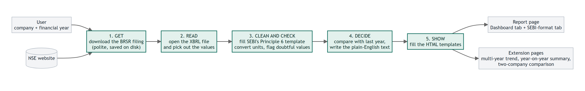
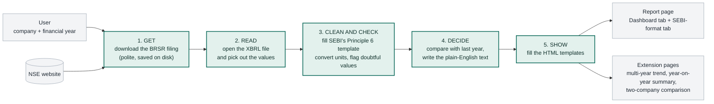

# Architecture

**What it does:** give it a listed Indian company and a financial year. It gets the company's BRSR filing from NSE, reads it, cleans and checks the numbers, and writes **one HTML page** with a plain-English *Dashboard* tab and a *SEBI-format* tab.

```
python flow.py --company "Reliance" --fy 2023-24      ->      output/RELIANCE_2023-24.html
```

## The flow



<details>
<summary>Diagram source (Mermaid), only needed to edit the picture</summary>



</details>

## The five steps in plain words

| Step | What happens | Where in the code |
|---|---|---|
| **1. Get** | Find the company on NSE, pick the filing for the year, download it. Polite to NSE: 3 seconds between requests, and a filing is never downloaded twice. | `brsr_p6/download/` |
| **2. Read** | The filing is an XBRL (XML) file: a long list of facts, each tagged with its year. We read it and work out which year is "current" and which is "previous". | `brsr_p6/parsing/` |
| **3. Clean and check** | Put every fact into SEBI's official Principle 6 layout, convert to one standard unit per topic, and add a warning when a number looks wrong. A number is never changed or invented. | `brsr_p6/extraction/`, `brsr_p6/core/` |
| **4. Decide** | Work out *better, worse or about the same* against the company's own previous year, and write the plain-English sentences. | `brsr_p6/analysis/`, `brsr_p6/views/` |
| **5. Show** | Fill the HTML templates. The templates only print what step 4 decided. | `brsr_p6/rendering/` |

`brsr_p6/workflows/` runs the five steps in order, and `brsr_p6/cli/` is the command line (`flow.py`) that starts it.

## Three ideas behind the design

1. **Never invent a number.** A missing value stays "Not reported", a converted value says so, and a doubtful value is shown exactly as filed with a note. Every figure can be traced back to the filing's own element.
2. **Each step only hands plain data to the next one.** Because of that, every step can be tested on its own without the internet. The code is split into nine layers, and a test fails if a layer uses one it should not.
3. **The same clean data feeds everything.** The Dashboard, the SEBI tab and the three extensions are all built from the same data in step 3, so they cannot disagree.

## When something goes wrong

Unknown company, no filing for that year, NSE not reachable, a damaged file: each one produces a clear **error page** that says what happened and what to try, instead of a crash or a silent blank.
