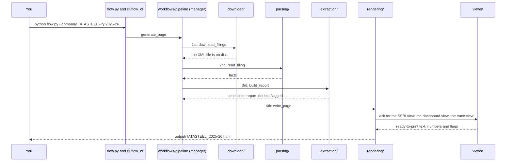

# Demo guide

Everything you need to **give the demo and explain the project**, written for someone who does not code. Read it top to bottom once (about 20 minutes),
then practise the script in section 10. For deeper learning and interview questions use `learnings.md`; for copy-paste commands use `commands.md`.

| Section | What it gives you |
|---|---|
| 1 | The problem (what to say first) |
| 2 | What we built |
| 3 | The 60-second pitch |
| 4 | The flow in one picture |
| 5 | **Where the code starts and what runs first** (trace one company) |
| 6 | Who calls whom (a second diagram) |
| 7 | **The architecture: every folder and file, and what it is responsible for** |
| 8 | The page itself: the two views |
| 9 | The three honesty rules |
| 10 | **The demo script** (10 minutes) |
| 11 | If they say "show me the code" |
| 12 | If something goes wrong during the demo |
| 13 | Ten words you must know |

---

## 1. The problem, in plain words

**The background.** In India the top 1,000 listed companies must publish a yearly **BRSR** report (Business Responsibility and Sustainability Report) saying how they treat the
environment, their people and society. **Principle 6** is the environment chapter: how much **energy** they use, how much **water**, how much **pollution** and **greenhouse gas**
they release, how much **waste** they make, and whether they follow the rules.

**The trouble.** These reports are long, full of tables, and written for specialists. A normal person (an investor, a journalist, a student) cannot tell: *Is this company's footprint big
or small? Is it getting better or worse? Can I trust these numbers?* Also, the files are messy: units are missing or different, some numbers are typed in the wrong scale, some zeros
mean "none" and some mean "not measured".

**The assignment.** Build a tool where you type **a company and a year**, and it produces **one web page** that shows the company's Principle 6 information **twice**:

1. **In SEBI's official format**: laid out exactly like SEBI's template (same question numbers, tables, row labels, units), so a reviewer can hold the two side by side.
2. **As a dashboard for a non-expert**: plain English, what each number means, whether it got better or worse, and why it matters.

**The rules we were given.** Use only public data (NSE's filings and SEBI's template). Never invent a number. If a value is missing, converted or estimated, say so on the page.
Do not hammer NSE's website. It must work for any company, not just a few. Errors must give clear, specific messages.

**How it is graded.** Dashboard clarity **30%** · data accuracy **25%** · SEBI-format fidelity 15% · error handling 10% · code quality 10% · extensions 10%.

---

## 2. What we built

One command:

```powershell
python flow.py --company "Tata Steel" --fy 2025-26 --open
```

It downloads the company's filing from NSE (the first time), reads it, cleans and checks the numbers, and writes **one HTML page** that opens in any browser, with **two tabs**:

- **Dashboard** (opens first): a one-sentence summary, a scoreboard, six topics (energy, climate, water, air, waste, safeguards), a "Can I trust these numbers?" section and a glossary.
- **SEBI-format report**: Principle 6 exactly as SEBI lays it out, with a last section "Where every number comes from".

Beyond the core task we also built the three optional extensions (all under the same command):
`flow.py trends` (several years side by side), `flow.py summary` (what got better and worse since last year), `flow.py compare` (two companies for one year), and `flow.py hub`
(a home page where you pick a company and year, plus a compare page). You do not need to demo these unless asked.

---

## 3. The 60-second pitch (say this first)

> "You give the tool a listed Indian company and a financial year. It produces one web page with that company's BRSR Principle 6 environment disclosures twice: exactly in SEBI's official
> format, and as a plain-English dashboard for someone who has never read a BRSR.
>
> The data comes from NSE, which publishes each company's filing as a structured file, so I read that instead of trying to pull numbers out of PDF tables.
> The flow is: **find the company, download its filing politely, read the file, match every value to SEBI's template rows, clean and check it, decide what to say, and print the page.**
>
> Three rules run through everything: **never invent a number**, **show doubt instead of hiding it**, and **keep the code that gets the data separate from the code that presents it.**"

If you remember only one sentence: **"Python decides what to say; the template only prints it."**

---

## 4. The flow in one picture

Think of a **factory conveyor belt**. Raw material (the company's filing) goes in at one end, passes through stations, and a finished product (the web page) comes out at the other end.

```
  YOU TYPE:  python flow.py --company "Tata Steel" --fy 2025-26
        |
        v
 +------------------+
 | 1. COMMAND       |  reads what you typed; if anything fails, writes an error page instead
 |  cli/            |
 +--------+---------+
          v
 +------------------+
 | 2. MANAGER       |  puts the steps in order: download, read, clean, print
 |  workflows/      |
 +--------+---------+
          v
 +------------------+     NSE website (the only place we use the internet)
 | 3. DOWNLOAD      |  "Tata Steel" -> TATASTEEL -> which filings exist -> save the XML file
 |  download/       |  ---> data/raw/TATASTEEL/2025-26/  (a saved copy, so next time = no internet)
 +--------+---------+
          v
 +------------------+
 | 4. READ          |  the XML file -> a plain list of facts: name, value, unit, which year
 |  parsing/        |
 +--------+---------+
          v
 +------------------+
 | 5. CLEAN + CHECK |  facts -> SEBI's rows, current and previous year; convert units;
 |  extraction/     |  flag anything doubtful (never change it); remember where each number came from
 +--------+---------+  ---> data/parsed/TATASTEEL/2025-26.json  (the clean data, saved)
          v
 +------------------+
 | 6. DECIDE        |  every sentence, number, "better/worse" verdict and warning is decided here
 |  views/          |  (plain Python, no HTML, so it can be tested)
 +--------+---------+
          v
 +------------------+
 | 7. PRINT         |  fills the HTML templates with those decisions and writes ONE page
 |  rendering/      |
 +--------+---------+
          v
  output/TATASTEEL_2025-26.html     <- open it in a browser
```

Underneath all stations sits `core/`: the shared tools (the data shapes, error messages, year handling, units, number formatting, SEBI's template). `analysis/` holds the "better / worse" rules.

---

## 5. Where the code starts, and what runs first

You asked: *if I give one company, which step triggers first: download, parsing, or something else?* **The download runs first. Then reading, cleaning, deciding, printing.**
You can see this live: run the command and watch the terminal; the lines appear in the order below.

### 5.1 The trace, step by step

| # | What you see in the terminal | File and function that runs | What it does |
|---|---|---|---|
| 0 | (you press Enter) | `flow.py` | Ten lines. It only starts the real program: `from brsr_p6.cli.flow_cli import main` |
| 1 | | `brsr_p6/cli/flow_cli.py` -> `main()` then `run_flow()` | Reads `--company` and `--fy`. If the first word is `download`, `trends`, `summary`... it runs that sub-command instead; otherwise it is the flow |
| 2 | | `brsr_p6/workflows/pipeline.py` -> `generate_page()` | **The manager.** It calls the stations in order, below |
| 3 | | `pipeline.load_report()` | Checks the year text first (a typo never costs a request to NSE), then calls the downloader |
| 4 | `Company: Tata Steel Limited (TATASTEEL)` | `download/company_lookup.py` -> `resolve_company()` | Turns "Tata Steel" into NSE's symbol `TATASTEEL`. Asks NSE's search once, then remembers the answer |
| 5 | `NSE has BRSR filings for: FY 2022-23 ... FY 2025-26` | `download/filings.py` -> `list_filings()` | Asks NSE which filings exist (cached for 24 hours) |
| 6 | `[1/1] FY 2025-26` | `download/filings.py` -> `select_filing()` | Picks the row for the year you asked for. If there is none: a specific error |
| 7 | `XML: downloaded` (next time: `already on disk, skipped`) | `download/downloader.py` -> `download_filings()`, and `download/nse_client.py` | Downloads the XML file, **waiting 3 seconds between requests**, and saves it in `data/raw/TATASTEEL/2025-26/` with a small `filing.json` |
| 8 | | `parsing/xbrl_reader.py` -> `read_filing()` | Opens the XML and turns it into plain **facts** (name, value, unit, year). Decides which are "this year" and "last year" from the dates inside the file |
| 9 | | `extraction/extractor.py` -> `build_report()` | **The heart.** Goes through SEBI's template (`core/sebi_template.py`) row by row, finds each value using the table in `parsing/p6_mapping.py`, cleans it (`extraction/values.py`), converts units (`core/units.py`) and stores each as a `Cell` that remembers where it came from |
| 10 | | `extraction/checks.py` -> `run_checks()` | Looks for numbers that do not make sense (for example Tata Steel's emissions typed in millions) and **adds a note**. It never changes a number |
| 11 | | `extraction/report_io.py` -> `save_report()` | Saves the clean data as JSON in `data/parsed/` |
| 12 | | `rendering/render.py` -> `write_page()` then `render_page()` | Asks the three "deciders" below for their results, then fills the template |
| 13 | | `views/sebi_view.py`, `views/dashboard_view.py` (with `dashboard_cards.py`, `metric_info.py`, `analysis/comparison.py`), `views/trace_view.py` | Decide the SEBI tables, the dashboard (sentences, cards, verdicts) and the "where every number comes from" section |
| 14 | | `rendering/templates/base.html` (+ `dashboard.html`, `sebi.html`, `trace.html`, the CSS files) | Prints it all as **one HTML file** with two tabs |
| 15 | `Report page written to: ...\output\TATASTEEL_2025-26.html` | back in `flow_cli.run_flow()` | Tells you where the page is; with `--open` it opens the browser |

**If anything fails** (unknown company, a year NSE does not have, a damaged file), the failure travels back up to `flow_cli.run_flow()`, which calls `cli/common.py` -> `views/error_view.py` and
`rendering` to write `output/error_<company>_<year>.html`: a page that explains in plain words what went wrong and gives commands to try.

### 5.2 How to trace it yourself, with no coding

1. Open `flow.py` (10 lines). It points to `flow_cli`.
2. Open `brsr_p6/cli/flow_cli.py`, find `run_flow`. It calls `generate_page`.
3. Open `brsr_p6/workflows/pipeline.py`, find `generate_page` and `load_report`. This short file *is* the flow: you can read the order of the stations in about 20 lines.
4. Each station is one folder; open the one you want to explain.

Another way: run the command twice. The first run prints `XML: downloaded` (and takes about 10 seconds). The second prints `already on disk, skipped` and finishes in under a second. That is the cache working.

---

## 6. Who calls whom (a second picture)



(If your viewer does not draw this diagram, the picture in section 4 says the same thing.)

---

## 7. The architecture: every folder and file

The code lives in the folder `brsr_p6/`, split into **nine folders** (called *packages*). They are listed from the bottom to the top. **The rule: a folder may use only itself and the folders
listed before it**, never the ones after it. For example `core` knows nothing about `views`; `views` knows nothing about how a page is saved. A test (`tests/test_architecture.py`) checks this rule
every time the tests run, so nobody can break it by accident.

The root of the project has only **one** code file, `flow.py` (a launcher with no logic).

### 7.1 Folder by folder

| Folder | Its job (one line) | Think of it as |
|---|---|---|
| `core/` | Shared tools used by everyone | The toolbox and the dictionary |
| `download/` | Talk to NSE politely and keep the files on disk | The delivery person |
| `parsing/` | Read the XML file into plain facts | The translator |
| `extraction/` | Turn facts into one clean report; flag doubts | The quality inspector |
| `analysis/` | The rules for "better / worse / same" and trends | The judge |
| `views/` | Decide what every page says | The writer |
| `rendering/` | Fill the HTML templates and write the file | The printer |
| `workflows/` | Whole jobs, steps in order | The manager |
| `cli/` | The commands you type | The front door |

### 7.2 File by file

**`core/`** (shared tools)

| File | Responsible for |
|---|---|
| `models.py` | The data shapes: `Cell` (one number with its unit, status, origin, warnings), `Metric` (a row), `Principle6Report` (everything) |
| `sebi_template.py` | SEBI's official Principle 6 form **as data**: 12 Essential and 9 Leadership questions with the official wording and row labels |
| `errors.py` | Every kind of error we raise on purpose (unknown company, no filing, damaged file, ...), each carrying a clear message |
| `fiscal_year.py` | Understanding years: `"FY2023-24"`, `"2023/24"` all become `2023-24`; years before FY 2021-22 are refused |
| `units.py` | Converting to one unit per topic (energy to GJ, water to kL, waste and air to tonnes, gases to tCO2e) and saying what was changed |
| `formatting.py` | Showing numbers the Indian way (2,47,98,900) and small numbers readably |
| `friendly.py` | Saying numbers in words: "46.42 crore GJ", "4.7% less than last year" |
| `paths.py` | The one place that knows where the project folders are (`data/`, `output/`, `samples/`) |

**`download/`** (NSE)

| File | Responsible for |
|---|---|
| `nse_client.py` | The **only** code that touches the internet: 3-second spacing, retries, stop-if-blocked, safe saving |
| `company_lookup.py` | "Tata Steel" or "TATASTEEL" -> the company; lists the matches if the name is ambiguous |
| `filings.py` | Asking NSE for the list of filings, reading it, choosing the right year, noting missing years |
| `downloader.py` | The manager of this folder: checks, finds the company, lists, chooses, downloads, never downloads twice |

**`parsing/`** (read the file)

| File | Responsible for |
|---|---|
| `xbrl_reader.py` | Opening the XML, cleaning illegal characters, working out which facts are this year / last year, detecting the form edition |
| `p6_mapping.py` | The table "this SEBI row is fed by this XML tag", separately for the older and the newer form editions |

**`extraction/`** (clean report)

| File | Responsible for |
|---|---|
| `extractor.py` | Filling the template row by row from the facts (`build_report`) |
| `values.py` | Cleaning small bits of text: `"1,83,595"` -> a number, `"NA"` -> nothing; counting how many digits a figure really has |
| `checks.py` | Spotting numbers that do not make sense and adding notes (wrong scale, rounded-away zeros, totals that do not add up) |
| `report_io.py` | Saving the clean report as JSON |

**`analysis/`** (the judge)

| File | Responsible for |
|---|---|
| `comparison.py` | Improved / got worse / about the same / can't compare, with the honest "can't tell" cases |
| `warning_kinds.py` | Sorting each note into "check" (probably right, handle with care) or "doubtful" (probably wrong) |
| `trend_model.py` | For the multi-year page: columns per year, borrowing a missing year from the next filing, restatements, basis changes |

**`views/`** (the writer)

| File | Responsible for |
|---|---|
| `sebi_view.py` | What each cell, row and footnote of the SEBI tab shows |
| `dashboard_view.py`, `dashboard_cards.py` | The dashboard: summary sentence, scoreboard, topics, one card per figure, safeguards, the trust section |
| `metric_info.py` | All the plain-English wording as data: titles, "what it is", "why it matters", which direction is better |
| `trace_view.py` | The words of "where every number comes from" |
| `error_view.py` | The words of every error page |
| `report_text.py` | The report as plain text for the terminal (`flow.py extract`) |
| `trend_view.py`, `summary_view.py`, `compare_view.py`, `hub_view.py` | The words and groupings of the extension pages and the two viewer pages |

**`rendering/`** (the printer)

| File | Responsible for |
|---|---|
| `render.py` | Filling a template with a view and writing the file; the names of the output files |
| `templates/base.html` | The page frame: header, facts box, the two tabs |
| `templates/dashboard.html`, `dashboard_macros.html` | The Dashboard tab and its reusable pieces (card, chip, bar) |
| `templates/sebi.html`, `trace.html` | The SEBI-format tab and the "where every number comes from" section |
| `templates/style.css`, `dashboard.css` | The look. Every dashboard rule starts with `.dash` so it cannot disturb the SEBI tab |
| `templates/error.html` (+ css) | The error page |
| `templates/trends.html`, `summary.html`, `compare.html` (+ css) | The extension pages |
| `templates/hub.html`, `compare_hub.html`, `hub.css`, `hub.js` | The two viewer pages (the only pages with a little JavaScript, because a dropdown needs it) |

**`workflows/`** (the manager)

| File | Responsible for |
|---|---|
| `pipeline.py` | **The flow itself:** company + year -> download -> read -> clean -> page (`generate_page`) |
| `trend_loader.py`, `summary_loader.py` | Loading the years a trend or summary needs (one bad year never stops the others) |
| `compare.py`, `missing_pages.py`, `hub.py` | Comparing two companies; making the missing summaries and trends offline; gathering every page into the two viewers |
| `samples.py` | Rebuilding the committed pages in `samples/` |

**`cli/`** (the front door)

| File | Responsible for |
|---|---|
| `flow_cli.py` | The whole flow, and the dispatcher: which sub-command you typed |
| `download_cli.py`, `extract_cli.py`, `trend_cli.py`, `summary_cli.py`, `compare_cli.py`, `hub_cli.py`, `samples_cli.py` | One sub-command each |
| `common.py` | What every command does on failure: explain it on a page |

### 7.3 Where things are saved

| Folder | What is in it | In the repository? |
|---|---|---|
| `data/raw/<SYMBOL>/<FY>/` | The downloaded XML filing and `filing.json` | A few are committed (so tests and samples work offline); the rest are downloaded on demand |
| `data/cache/` | Saved company-search results | No |
| `data/parsed/` | The clean report as JSON | No |
| `output/` | The pages you generate | No |
| `samples/` | Example pages for 5 companies, plus error pages and extension pages, committed so reviewers see results without running anything | **Yes** |
| `tests/` | The automatic tests, in folders mirroring `brsr_p6/` | Yes |

---

## 8. The page itself: two views of the same data

Both tabs are built from the **same clean report**, so they always start from the same numbers.

**Dashboard tab** (the part graded most: 30%). Say these points while you scroll:

1. **One sentence first** ("In FY 2025-26, Tata Steel used 62.38 crore GJ of energy (6.2% more than last year)...") and a **scoreboard** (1 improved, 4 about the same, 6 got worse).
2. **Six topics in story order**: energy, climate, water, air quality, waste, safeguards. Each opens with a headline sentence built from the numbers.
3. **Every card explains itself**: a plain title, **which direction is better** ("Lower is better"), **what it is**, **why it matters**, the units, and bars comparing this year with last year.
4. **Intensity next to the total** ("per ₹ 1 crore of sales"), because a bigger company uses more in total.
5. **Indian number words** (lakh, crore), matching the SEBI tab.
6. **Never colour alone**: every verdict is words plus a symbol (✔ ✖ ≈ ?) plus an arrow, so it reads in black and white and on a phone.
7. **"Better" means better than the company's own last year**, and nothing else: the filings contain no industry benchmark, and inventing one would break "never invent numbers". The page says so.
8. **"Can I trust these numbers?"**: how many numbers were reported as filed, how many we added up or converted, how many were not reported (shown as "Not reported", never 0), and what the notes mean.

**SEBI-format tab.** Hold it next to SEBI's template: same question numbers (Essential 1-12, Leadership 1-9), same tables and row labels, current and previous year columns. A value the company did not report says **"Not reported"** explicitly. Small marks: `calc.` = we added reported numbers, `conv.` = we changed the unit, `ⓘ1` = a note under the table. The last section lists **every number with the exact XML element it was read from** and the text as filed.

---

## 9. The three honesty rules (this is what makes the project trustworthy)

1. **Never invent a number.** If something is missing it says **"Not reported"** (never 0). If we added numbers together it says *calc.*; if we changed a unit it says *conv.* and keeps the original.
2. **Show doubt, do not hide it, and do not fix it.** Real example: **Tata Steel's greenhouse gas figure.** The company typed `64` where it means *64 million* tonnes. Our check notices that 64 tonnes is about a million times too small for a steel company's energy use. The page shows **"64" exactly as filed**, with a grey note explaining the doubt, **gives it no better/worse verdict, and leaves it out of the summary sentences.** We cannot know what the company meant, so fixing it would be inventing a number.
3. **Every number traces back to the filing.** Each number remembers the XML element it came from. A test re-reads the raw XML a second, independent way and checks every number on the page against it.

---

## 10. The demo script (about 10 minutes)

Before you start: open the project in PyCharm, open the **Terminal** (it should show `(.venv)`), and have a browser ready. Everything below is also in `commands.md`.

| Min | What you do | What you say |
|---|---|---|
| 0-1 | Show the folder tree; open `README.md` at the top | The 60-second pitch (section 3). "There is one command, `flow.py`." |
| 1-2 | `python flow.py --company "Tata Steel" --fy 2025-26 --open` | "One command. It downloads the filing from NSE the first time, politely, and caches it. The second time it takes under a second." Point at the terminal lines (section 5) as they appear |
| 2-6 | **Dashboard tab.** Scroll slowly: summary and scoreboard -> click a topic tile (e.g. Energy) -> one card -> **Climate** -> "Can I trust these numbers?" -> glossary | "Written for someone who has never read a BRSR. Each number says what it is, whether lower or higher is better, why it matters, and whether it improved on its own last year. Bars start at zero. Words plus symbols, not just colour." |
| 6-7 | On **Climate**, show Tata Steel's greenhouse-gas card (grey dashed, "Can't compare") | "This figure looks about a million times too small. We show it exactly as filed, say it looks doubtful, give no verdict and keep it out of the sentences. I never silently fix a number." |
| 7-8 | Click the **SEBI-format report** tab; scroll to Essential 1; scroll to the last section "Where every number comes from" | "Same numbering and row labels as SEBI's form. 'Not reported' is explicit. Every number traces to the exact element in the filing; the header links to the filing on NSE." |
| 8-9 | **Errors:** `python flow.py --company "Xyzzy Quux" --fy 2023-24 --open`, then `python flow.py --company "Tata Steel" --fy 2019-20 --open` | "A specific message on a page, what to try next, commands to copy. The 2019-20 case says clearly that BRSR filings are covered from FY 2021-22." |
| 9-10 | `pytest -q`; show the folder tree `brsr_p6/` and `tests/test_architecture.py` | "About 720 automatic tests, no internet needed. Extraction is separate from presentation, and a test enforces the folder order." |
| if asked | `python flow.py hub --open` | The home page: pick a company and year; a **Compare two companies** button opens a second page. Then say the extensions are summarised in `learnings.md` part 5 |

**Tips.** Speak slowly. When you do not know something, open `learnings.md` part 7 in your head: say what you *do* know, then say "I would check that in the code". Do not guess numbers; open the page.

---

## 11. If they say "show me the code"

Open these in this order (each one is short at the top, with a description in its first lines):

1. `flow.py`: "ten lines; it only starts the real program".
2. `brsr_p6/workflows/pipeline.py`: "this is the flow: download, read, clean, print, in order".
3. `brsr_p6/core/sebi_template.py`: "SEBI's form stored as data; the SEBI tab simply loops over it".
4. `brsr_p6/parsing/p6_mapping.py`: "which XML tag feeds which row, for the old and new editions".
5. `brsr_p6/extraction/checks.py`: "where the doubtful numbers are caught".
6. `brsr_p6/views/dashboard_view.py` and `metric_info.py`: "where every sentence and verdict is decided; the wording is data".
7. `brsr_p6/rendering/templates/base.html`: "the template only prints; the two tabs are CSS-only, no JavaScript".
8. `tests/test_architecture.py`: "the test that enforces the folder rule".

---

## 12. If something goes wrong during the demo

| Problem | What to do |
|---|---|
| No internet, or NSE is slow or blocks | Use a company already downloaded (Tata Steel, Reliance, Wipro, Infosys, HDFC Bank, ICICI Bank on this machine: `python flow.py --company Reliance --fy 2023-24 --open` works offline), or open the committed pages: `samples/index.html` |
| The interviewer asks for a company you have not downloaded | Run it live: about 10 seconds. If NSE answers "no filing", that *is* a good demo of the error page |
| A command prints something unexpected | Read the last line; every known problem has its own message and an `output\error_*.html` page. Add `--debug` to see the technical details |
| The page looks old | Re-run the command, then refresh the browser (the page is regenerated every time) |
| You forget a command | `python flow.py --help` lists everything |

---

## 13. Ten words you must know

| Word | In plain words |
|---|---|
| **BRSR / Principle 6** | SEBI's sustainability report / its environment chapter |
| **NSE** | The stock exchange that publishes the filings |
| **XBRL** | A file format where every number has a name, a unit and a year, so a program can read it exactly |
| **Filing** | One company's report for one year |
| **Standalone / consolidated** | The company alone / the company with its subsidiaries (the page always says which) |
| **Intensity** | A figure per unit of sales (per ₹ 1 crore), fairer than a total |
| **Cache** | A saved copy, so we do not ask NSE again |
| **Package / module** | A folder of code / one code file |
| **Template** | An HTML file with blanks that the program fills in |
| **Test** | A small piece of code that checks other code still works |
